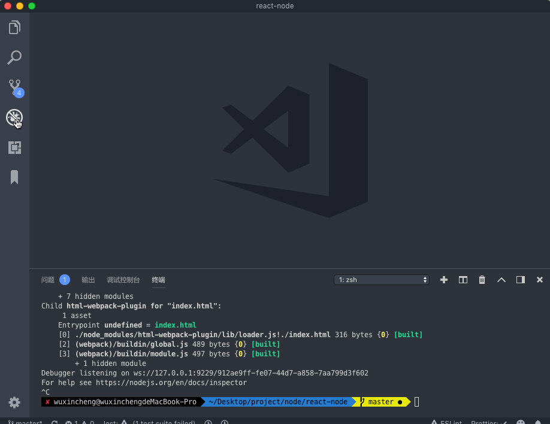

## 说明

模仿 koa 制作一个简易后端框架，功能如下：

- [ ] 仿写简易的koa框架
- [ ] 路由控制
- [ ]  react后端渲染


## 目录结构

```
├── client	// 放置react组件
│   ├── App.js
│   └── entry.js
├── index.html	// HtmlWebpackPlugin使用的模板
├── koa	// 模仿的koa框架
│   ├── application.js
│   ├── context.js
│   ├── request.js
│   └── response.js
├── package.json
├── public	// react组件编译输出后的路径
│   └── assets
│       ├── index.html
│       ├── main.js
│       ├── runtime.js
│       └── vendors.js
├── server	// 服务端相关
│   ├── controller	// 路由执行
│   │   ├── home.js
│   │   └── react.js
│   ├── index.js	// 服务器启动主入口
│   ├── middleware	// 中间件
│   │   └── staticFile.js
│   └── router.js
├── webpack.config.js
├── yarn-error.log
└── yarn.lock
```

## 关于koa

参考网上的源码解析和简单koa例子，链接：

- [node进阶——之事无巨细手写koa源码](https://juejin.im/post/5ba48fc4e51d450e704277fa#heading-16)
- [深入浅出koa2](https://github.com/berwin/Blog/issues/9)
- [深入浅出koa](https://github.com/berwin/Blog/issues/8)
- [koa源码](https://github.com/koajs/koa)
- [koa-compose源码](https://github.com/koajs/compose/blob/master/index.js)

## 关于路由

写了一个`Router`类，将请求路径对应的业务逻辑函数作为最后一个中间件插入。

## vscode调试

运行的指令为`yarn start`

```json
 "scripts": {
    "start": "babel-node server/index.js",
  },
```

修改`.vscode/launch.json`，添加配置



```json
{
  "version": "0.2.0",
  "configurations": [
    {
      "type": "node",
      "request": "launch",
      "name": "Launch via NPM",
      "runtimeExecutable": "npm",
      "runtimeArgs": ["run-script", "debug"],
      "port": 9229
    }
  ]
}
```


这里指定了调试使用`npm`执行，参数为`"run-script", "debug"`，连起来也就是运行`npm run debug`，调试的端口是9929。

在`package.json`中添加`scripts`

```json
 "scripts": {
    "start": "babel-node server/index.js",
    "debug": "babel-node --nolazy --inspect=9229 server/index.js"
  },
```

注意`--inspect`需要和上面的调试端口对应

最后在vscode调试页面运行即可。