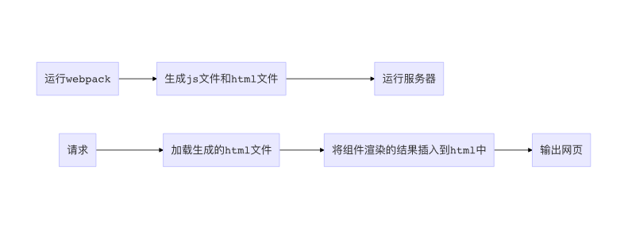
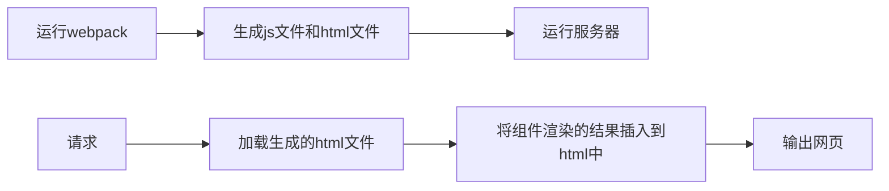

## 说明

模仿 koa 制作一个简易后端框架，功能如下：

- [x] 仿写简易的koa框架
- [x] 路由控制
- [x] react后端渲染
- [ ] 热更新


## 目录结构

```
├── client	// 放置react组件
│   ├── App.js
│   └── entry.js
├── index.html	// HtmlWebpackPlugin使用的模板
├── koa	// 模仿的koa框架
│   ├── application.js
│   ├── context.js
│   ├── request.js
│   └── response.js
├── package.json
├── public	// react组件编译输出后的路径
│   └── assets
│       ├── index.html
│       ├── main.js
│       ├── runtime.js
│       └── vendors.js
├── server	// 服务端相关
│   ├── controller	// 路由执行
│   │   ├── home.js
│   │   └── react.js
│   ├── index.js	// 服务器启动主入口
│   ├── middleware	// 中间件
│   │   └── staticFile.js
│   └── router.js
├── webpack.config.js
├── yarn-error.log
└── yarn.lock
```

## 关于koa

参考网上的源码解析和简单koa例子，链接：

- [node进阶——之事无巨细手写koa源码](https://juejin.im/post/5ba48fc4e51d450e704277fa#heading-16)
- [深入浅出koa2](https://github.com/berwin/Blog/issues/9)
- [深入浅出koa](https://github.com/berwin/Blog/issues/8)
- [koa源码](https://github.com/koajs/koa)
- [koa-compose源码](https://github.com/koajs/compose/blob/master/index.js)

## 关于路由

写了一个`Router`类，在构造函数中声明添加路由的方法，这里只针对`'get', 'put', 'delete', 'post'`做了路由。

```javascript
['get', 'put', 'delete', 'post'].forEach(method => {
    this.list[method] = [];
    this[method] = (path, action) => {
    this.list[method].push([pathRegexp(path), action]);
  };
});
```

使用`router[method](path, controller)`添加路由，如：

```javascript
router.get('/hello', home.hello);
```

在处理请求时，将请求路径对应的业务函数作为最后一个中间件插入

```javascript
// 设置路由访问
if (this.router) {
  const action = this.router.matchPath(ctx.path, ctx.method.toLowerCase());
  middlewares.push(action);
}
```

## react后端渲染

后端渲染react组件分为两个步骤：

### 1. 将组件渲染为html

这主要使用了`react-dom`下的`renderToString`，这个函数能将组件转化为html字符串，比如我有一个组件：

```react
// node下需要使用commonjs，和浏览器下使用的有所区别
const React = require('react');

class App extends React.Component {
  constructor(props) {
    super(props);
    this.state = {
      count: props.initialCount,
    };
    this.increment = this.increment.bind(this);
  }

  increment() {
    this.setState(state => ({ count: state.count + 1 }));
  }

  render() {
    const { count } = this.state;
    return (
      <div>
        <div>
          the count is:
          {count}
        </div>
        <button onClick={this.increment}>add</button>
      </div>
    );
  }
}

module.exports = App;
```

使用`renderToString`渲染组件：

```react
const ReactDOMServer = require('react-dom/server');
...
const componentHtml = ReactDOMServer.renderToString(<App initialCount={0} />)
...
```

渲染结果：

```html
<div data-reactroot="">
  <div>the count is:
    <!-- -->0
  </div>
  <button>add</button>
</div>
```

最后渲染的结果传入到预先准备好的html中输出就可以了

```javascript
`<!DOCTYPE html>
<html>
  <head>
    <meta charset="UTF-8">
  </head>
  <body>
    <div id="root">${componentHtml}</div>
  </body>
</html>`
```

但是这种方式只能渲染出一个静态的页面，没有绑定上js事件

### 2.绑定js事件

如果要绑定js事件，就需要浏览器执行组件的js代码，因为组件使用jsx语法，所以需要使用webpack的`jsx-loader`解析，修改webpack：

```react
// webpack.config.js
const path = require('path');

const assetsPath = path.join(__dirname, 'public', 'assets');

module.exports = {
  name: 'browser',
  entry: './client/entry.js',
  output: {
    path: assetsPath,
    filename: 'main.js',
  },
  mode: 'production',
  module: {
    rules: [
      { test: /\.js/, loader: 'jsx-loader' },
      {
        test: /\.css$/,
        use: ['style-loader', 'css-loader'],
      },
      {
        test: /\.(png|svg|jpg|gif)$/,
        use: ['file-loader'],
      },
      {
        test: /\.(woff|woff2|eot|ttf|otf)$/,
        use: ['file-loader'],
      },
    ],
  },
};

// ./client/entry.js
const React = require('react');
const ReactDOM = require('react-dom');
const App = require('./App');

ReactDOM.render(<App initialCount={0} />, document.getElementById('root'));
```

然后使用`webpack`指令解析react组件，按照上面的配置，会在`/public/asstes`下生成解析好的`main.js`文件，下面只要加载这个js文件即可。在刚才的html代码中，增加`<script>`标签：

```html
<body>
	<div id="root">${componentHtml}</div>
	<script type="text/javascript" src="main.js"></script>
</body>
```

现在访问页面时，浏览会去访问`http://127.0.0.1:port/main.js`这个资源，当然现在肯定是无法找到的，因为还需要一个静态资源解析，比如说，我这里简单地约定，所有的静态资源都放在`/public/asstes`下面，依据这个写一个静态资源解析的中间件（这里使用了`send`库）：

```javascript
// server/middleware/staticFile.js
const path = require('path');
const send = require('send');

const staticPath = path.join(process.cwd(), 'public');

module.exports = async (ctx, next) => {
  // 如果请求路径中带有assets，就认为是访问静态资源
  if (ctx.path.includes('assets')) {
    // 先取到客户端想要的是文件或文件夹路径
    const filePath = path.join(staticPath, ctx.path); // 服务器上的对应服务器物理路径
    try {
      ctx.status = 200;
      send(ctx.req, filePath).pipe(ctx.res);
    } catch (e) {
      ctx.throw('文件解析失败', 500);
    }
  } else {
    next();
  }
};

// server/index.js
const staticFile = require('./middleware/staticFile');
...
app.use(staticFile);
```

最后别忘了修改上面的`<script>`标签为`<script type="text/javascript" src="/assets/main.js"></script>`

现在页面上面的js事件已经能正确地执行了。

### 后续优化

上面的代码虽然跑通了，但是html模板还是需要自己手动修改，如果有多个`<script>`标签，或者为了解决缓存问题，js文件带有hash值，就变得很难维护，所以还是借助webpack，将这个过程变得自动化一些。

整个流程大致如下：





基于之前已经完成的，现在还差html生成和加载html

#### html 生成

这里使用`html-webpack-plugin`插件，用过react的对这个插件都不会陌生，这个插件能生成html文件，并自动引入js文件，修改webpack配置：

```javascript
const HtmlWebpackPlugin = require('html-webpack-plugin');
const CleanWebpackPlugin = require('clean-webpack-plugin');
...
const assetsPath = path.join(__dirname, 'public', 'assets');

module.exports = {
  name: 'browser',
  entry: './client/entry.js',
  output: {
    path: assetsPath,
    filename: '[name].[hash].js',	// 生成的文件带有hash值
    publicPath: '/assets/',	// 访问的路径前带有/assets/
  },
	...,
  plugins: [
  	// 依照index.html作为模板生成html文件
    new HtmlWebpackPlugin({
      template: './index.html',
    }),
    // 每次重新运行时，清空资源路径
    new CleanWebpackPlugin([assetsPath]),
  ],
};
```

这里的`index.html`是一个模板，主要目的是为了`<body>`中有一个id为root的`<div>`，比如这里我使用的模板是：

```html
<!DOCTYPE html>
<html>
  <head>
    <meta charset="UTF-8">
  </head>
  <body>
    <div id="root"></div>
  </body>
</html>
```

执行`webpack`后生成了index.html和main.a79cd3180bb4305db4ae.js文件，生成的index.html为：

```html
<!DOCTYPE html>
<html>
  <head>
    <meta charset="UTF-8">
  </head>
  <body>
    <div id="root"></div>
  	<script type="text/javascript" src="/assets/main.a79cd3180bb4305db4ae.js"></script>
  </body>
</html>
```

这时候如果访问`http://127.0.0.1:port/assets/index.html`是能够正常显示的。

#### 加载html

使用`fs`库加载index.html，使用`cheerio`解析html，并插入组件的html到`<div id="root"></div>`

```javascript
const React = require('react');
const ReactDOMServer = require('react-dom/server');
const path = require('path');
const cheerio = require('cheerio');
const fs = require('fs');

const App = require('../../client/App');

const staticPath = path.join(process.cwd(), 'public', 'assets');

module.exports = {
  count(ctx) {
    try {
      // 读取生成的html文件
      const staticPage = fs.readFileSync(`${staticPath}/index.html`);
      // 解析html
      const $ = cheerio.load(staticPage.toString());
      // 获取组件的html
      const componentHtml = ReactDOMServer.renderToString(<App initialCount={0} />);
      // 插入到<div id="root"></div>
      $('#root').html(componentHtml);
      // 输出html
      ctx.body = $.html();
    } catch (e) {
      ctx.throw(e.stack, 500);
    }
  },
};
```

最后修改一下`package.json`，每次运行服务之前，重新生成js和html

```json
 "scripts": {
    "start": "webpack && babel-node server/index.js",
  },
```

## vscode调试

运行的指令为`yarn start`

```json
 "scripts": {
    "start": "babel-node server/index.js",
  },
```

修改`.vscode/launch.json`，添加配置


```json
{
  "version": "0.2.0",
  "configurations": [
    {
      "type": "node",
      "request": "launch",
      "name": "Launch via NPM",
      "runtimeExecutable": "npm",
      "runtimeArgs": ["run-script", "debug"],
      "port": 9229
    }
  ]
}
```


这里指定了调试使用`npm`执行，参数为`"run-script", "debug"`，连起来也就是运行`npm run debug`，调试的端口是9929。

在`package.json`中添加`scripts`

```json
 "scripts": {
    "start": "babel-node server/index.js",
    "debug": "babel-node --nolazy --inspect=9229 server/index.js"
  },
```

注意`--inspect`需要和上面的调试端口对应

最后在vscode调试页面运行即可。